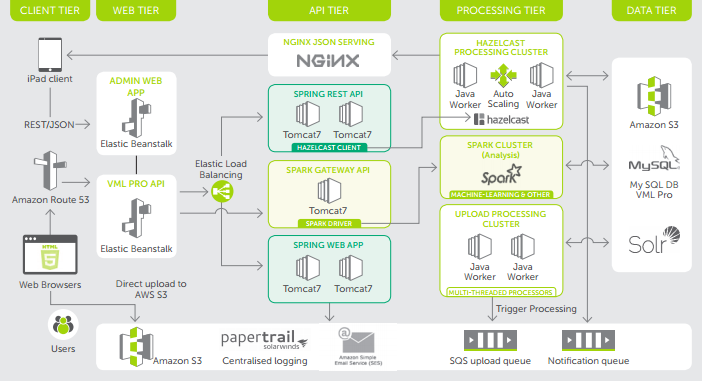

# Introduction

NeuroPro incorporates specialists from the fields of computer science, neurophysiology, bioengineering, and product and user-interface design. 
This combination of skills allows us to adopt an informed inter-disciplinary approach to the specific challenges facing those working in brain science. 
<br>
VmlPro Api is the data source of all other clients in Neuropro, providing variety of tools and analistic options for the developers on rival. 


# Authentication

VmlPro Api uses endpoint to retrieve SESSIONID that can be later used for endpoint access.

```json
#Successful response:
{
  "SUCCESS": 1,
  "SESSION_ID": "0A1A9BF836664AC4E9A9BB640E82B34C",
  "user": {
    "user_country": "Lebanon",
    "user_access_level": null,
    "provider_id": 8,
    "user_type": "",
    "user_city": "Beirut",
    "user_telephone": "70895649",
    "user_firstName": "Mohammed",
    "user_email": "mohammed.saad@lurner.com",
    "user_address1": "Beirut - Lebanon",
    "user_address2": "",
    "user_name": "msaad",
    "user_lastName": "Saad",
    "user_institution": "Neuropro",
    "user_id": 37
  }
}
```
```json
#Login failed:
{
  "SUCCESS": 0,
  "SESSION_ID": "",
  "ERROR": "Login failed"
}
```
SESSION_ID can be sent either by cookie or by assigning <code>;jsessionid={{session_id}}</code> after the endpoint url.

<aside class="notice">
	You must replace <code>{{session_id}}</code> with key from login endpoint.
</aside>

# MRI

## Get Test


```json
{
  "SUCCESS": 1,
  "TEST": {
    "id": 1102,
    "provider_id": 1,
    "mri_date": "20/9/2002",
    "hippocampal_atrophy": "-",
    "hippocampal_intensity_incr": "-",
    "hippocampal_malrotation": "-",
    "hippocampal_tumor": "-",
    "amygdala_atrophy": "-",
    "amygdala_intensity_incr": "-",
    "amygdala_tumor": "-",
    "cavernoma": "-",
    "angioma": "-",
    "aneurysma": "-",
    "venous_dysplasia": "-",
    "dural_fistula": "-",
    "tumor": "-",
    "cortical_dysplasia": "l",
    "tubers": "-",
    "polymicrogyria": "-",
    "pachygyria": "-",
    "lessencephaly": "-",
    "schizencephaly": "r",
    "hemimegalencephaly": "-",
    "contusion": "-",
    "ischemic_lesion": "-",
    "intracerebral_bleeding": "-",
    "atrophy": "-",
    "arachnoid_cyst": "-",
    "temp_lobe_intensity_incr": 0,
    "gray_white_matter_blurring": 0,
    "contrast_enhancement": 0,
    "micrencephaly": 0,
    "megalencephaly": 0,
    "hypothalamic_hamartoma": 0,
    "hydrocephalus": 0,
    "other_cort_developm_malform": "aa",
    "files": [
      {
        "id": 1002102,
        "mri_id": 1102,
        "diagnosis": 1102,
        "image": 1002102,
        "header": 1001102,
        "slice": 0,
        "provider_id": 1,
        "series": "Head/Neck series"
      }
    ]
  }
}
```

Retrieves information about specific MRI test.

### HTTP Request

`GET https://development.api.neuropro.ch/api/getmritestinfo`

### Query Parameters

Parameter | Type | Description
--------- | ---- | -----------
id | long | ID of test to retrieve

## Get Test List

```json
{
  "SUCCESS": 1,
  "TESTS": [
	{
		...
	},
	{
		...
	}
  ]
}
```

Retrieves a list of MRI tests based on authenticated user's provider.

### HTTP Request

`GET https://development.api.neuropro.ch/api/getmritestlist`

### URL Parameters

Parameter | Type | Description
--------- | ---- | -----------
files|bool|If this set to true, list of files will be included with each MRI test. Default: true

## Get Image List

```json
{
  "SUCCESS": 1,
  "FILES": [
    {
      "id": 1002102,
      "mri_id": 1102,
      "diagnosis": 1102,
      "image": 1002102,
      "header": 1001102,
      "slice": 0,
      "provider_id": 1,
      "series": "Head/Neck series"
    },
    {
      "id": 73002102,
      "mri_id": 1102,
      "diagnosis": 73102,
      "image": 73002102,
      "header": 73001102,
      "slice": 0,
      "provider_id": 1
    }
  ]
}
```

Retrieves list of DICOM images assosiated with MRI test.

### HTTP Request
`GET /getMriTestFiles`

### URL Parameters

Parameter | Type | Description
--------- | ---- | -----------
mri_id|long|ID of desired MRI test.


## Get Image List

```json
{
  "SUCCESS": 1,
  "TEST": {
    "id": 1002102,
    "mri_id": 1102,
    "diagnosis": 1102,
    "image": 1002102,
    "header": 1001102,
    "slice": 0,
    "provider_id": 1,
    "series": "Head/Neck series",
    "url": "https://vmlpro-mri.s3.amazonaws.com/..."
  }
}
```

Retrieves DICOM image by its id along with cloud download link and meta-data.  

### HTTP Request
`GET /getMriTestFile`

### URL Parameters

Parameter | Type | Description
--------- | ---- | -----------
id|long|ID of image to retrieve.
meta|bool|If this is set to true, DICOM image will be parsed and its metadata will be returned.

<aside class="notice">
	Setting <code>meta=true</code> will cause DICOM image to be pulled from cloud to VmlPro API, slowers the endpoint response significantly.
</aside>
